

  <picture>
    <source media="(prefers-color-scheme: dark)" srcset="./.github/readme/hero-name-dark.png">
    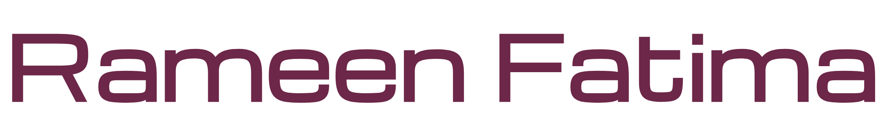
  </picture>

  <picture>
    <source media="(prefers-color-scheme: dark)" srcset="./.github/readme/hero-tagline-dark.png">
    
  </picture>

Computer Science student who likes building things end-to-end — AI simulations, custom data structures, OOP games, and a Mario clone in raw x86 Assembly.

🔭 Currently building software for the **Data Structures**, **OOP**, and **AI** courses at FAST-NUCES 
🌱 Learning how classic AI search/optimization algorithms (CSP, A*, Genetic Algorithms) come together in one system 
🛠️ Comfortable across the stack: from breadboard logic gates to Flask web apps 
💬 Ask me about C++ data structures, game dev with SFML, or wiring up an LLM chatbot

  <picture>
    <source media="(prefers-color-scheme: dark)" srcset="./.github/readme/h2-tech-stack-dark.png">
    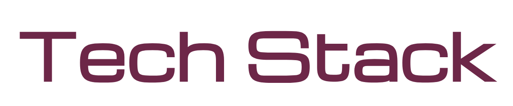
  </picture>

Icons link to the project (or the tool's own site) — click around.

**Languages**

**Frameworks & Libraries**

**Databases & Hosting**

**Tools & Design**

  <picture>
    <source media="(prefers-color-scheme: dark)" srcset="./.github/readme/h2-featured-projects-dark.png">
    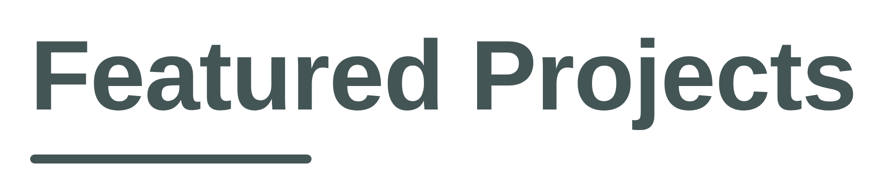
  </picture>

  <picture>
    <source media="(prefers-color-scheme: dark)" srcset="./.github/readme/h3-ai-algorithms-dark.png">
    
  </picture>

  <a href="https://github.com/rameenfatima325/Smart-City-Emergency-Response-and-Optimization-system">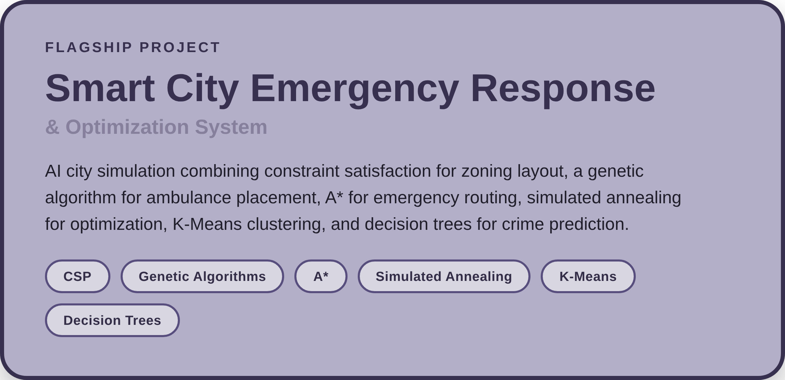</a>

  <a href="https://github.com/rameenfatima325/AI-Chatbot">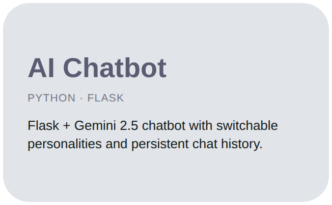</a>

  <picture>
    <source media="(prefers-color-scheme: dark)" srcset="./.github/readme/h3-systems-desktop-dark.png">
    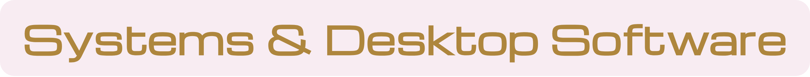
  </picture>

  
  <a href="https://github.com/rameenfatima325/Railway-Management-System">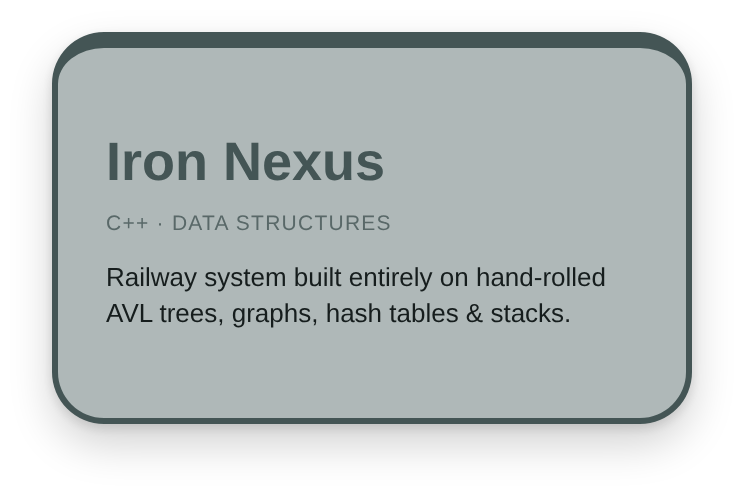</a>

  <picture>
    <source media="(prefers-color-scheme: dark)" srcset="./.github/readme/h3-games-dark.png">
    
  </picture>

  <a href="https://github.com/rameenfatima325/Galaxy-Wars">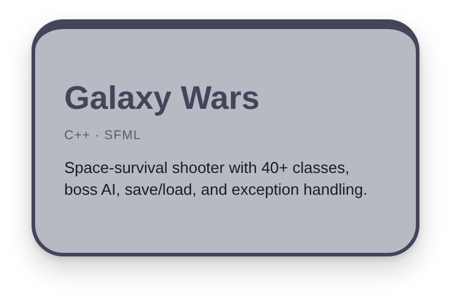</a>
  <a href="https://github.com/rameenfatima325/Xonix-Game">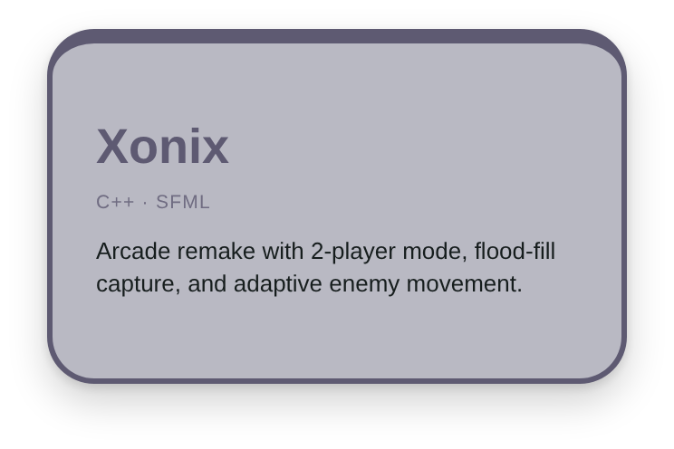</a>

  <a href="https://github.com/rameenfatima325/Super-Mario">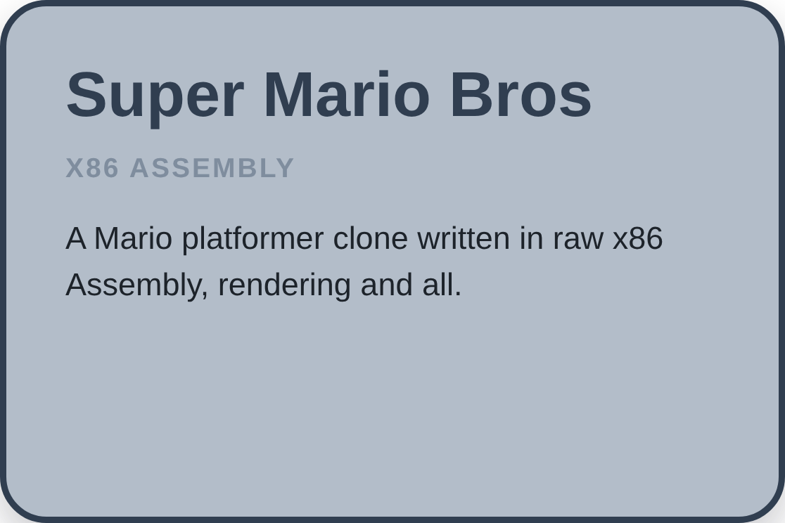</a>

  <picture>
    <source media="(prefers-color-scheme: dark)" srcset="./.github/readme/h3-hardware-dark.png">
    
  </picture>

  <a href="https://github.com/rameenfatima325/DLD-Calculator-Project">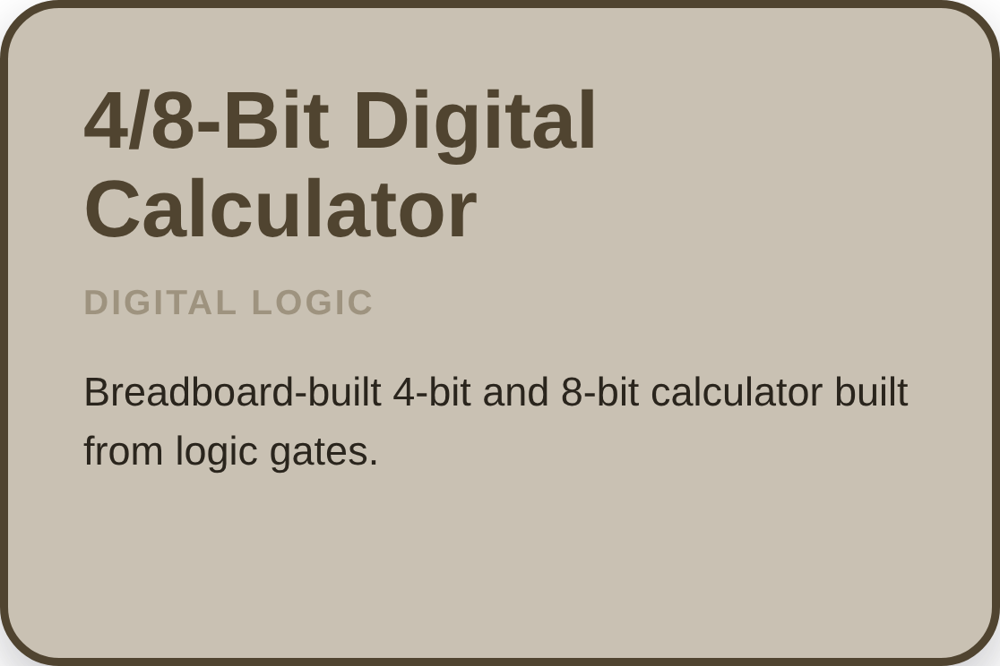</a>

  <picture>
    <source media="(prefers-color-scheme: dark)" srcset="./.github/readme/h2-github-stats-dark.png">
    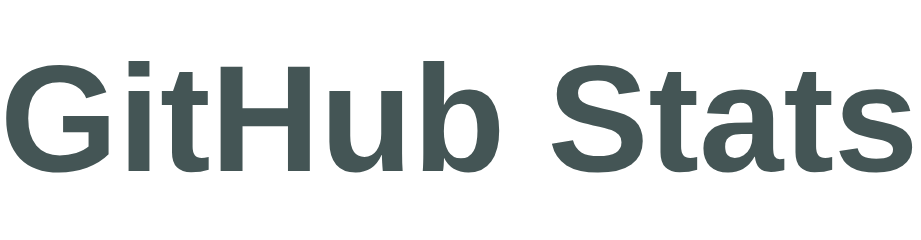
  </picture>

  <picture>
    <source media="(prefers-color-scheme: dark)" srcset="./.github/readme/stats-card-dark.png">
    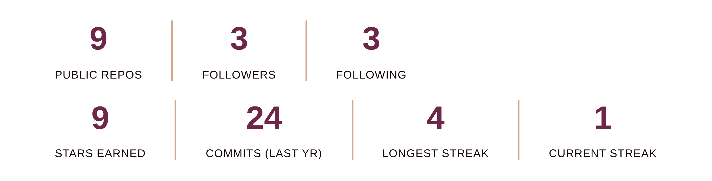
  </picture>

  <picture>
    <source media="(prefers-color-scheme: dark)" srcset="./.github/readme/commit-skyline-dark.svg">
    
  </picture>
  <picture>
    <source media="(prefers-color-scheme: dark)" srcset="./.github/readme/language-mix-dark.svg">
    
  </picture>

